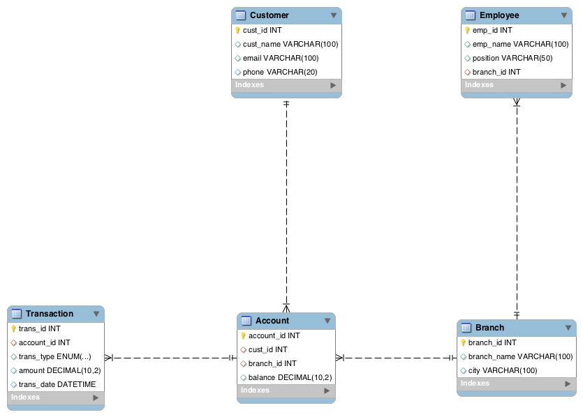

# Banking Transaction Database (MySQL Project)

This project simulates a real-world BANKING SYSTEM using MySQL, including customers, accounts, transactions, and branches.  
It supports analytical SQL queries for fraud detection, customer spending analysis, and branch performance.

---

## The Tools I Used
- MySQL Workbench (for ERD & schema design)
- MySQL RDBMS (for SQL queries)
- SQL scripts

---

## How to Run
1. Open MySQL Workbench.
2. Run `create_tables.sql` to create the database and tables.
3. Run `insert_data.sql` to populate data.
4. Run `analysis_queries.sql` to test fraud detection, customer spending, and branch performance.

---

## How is this project useful?
- It identifies suspicious accounts with large or frequent transactions.
- It is used to analyze total customer withdrawals.
- It evaluatea total transaction values across branches.

## ER Diagram

